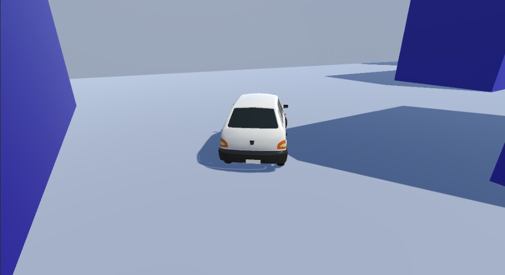
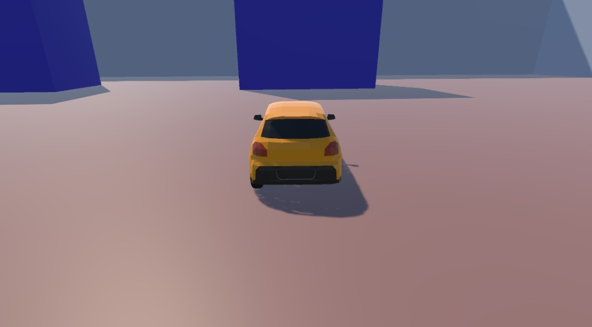

# Car Racing

An unfinished car racing game built in Unity.

## Features

- **Car physics** - Arcade-style driving with wheel colliders, motor force, steering, and brakes
- **Follow camera** - Smooth third-person camera that tracks the player car
- **Multiple vehicles** - Maruti 800, Swift, and Volkswagen prefabs
- **Terrain & roads** - EasyRoads3D integration for road creation, terrain tools for level design

## Controls

- **WASD / Arrow keys** - Accelerate and steer
- **Space** - Brake

## Scenes

- `CarControllerScene` - Basic car controller test
- `TerrainCarScene` - Driving on terrain with roads

## Requirements

- Unity (project uses standard assets and EasyRoads3D)
